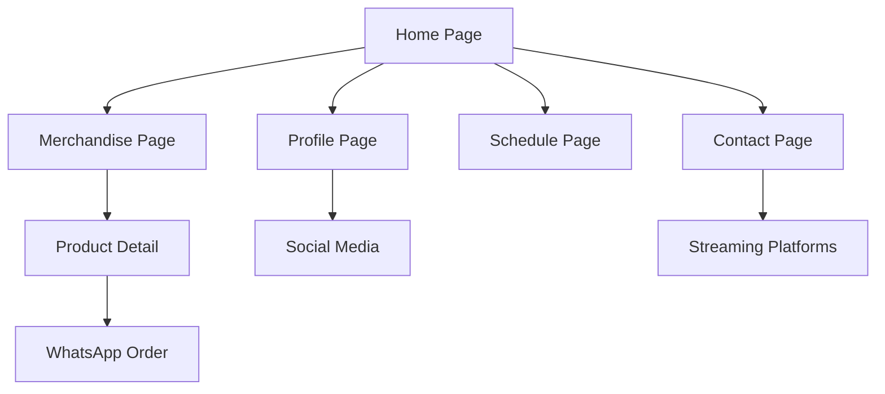

## 1. Product Overview
Website profile VTuber untuk mempromosikan konten, jadwal streaming, dan merchandise yang akan dijual di event Comipara. Platform ini membantu VTuber membangun brand awareness dan memfasilitasi penjualan merchandise secara online.

Target pengguna adalah fans VTuber dan pengunjung event Comipara yang tertarik dengan merchandise anime/vtuber.

## 2. Core Features

### 2.1 User Roles
| Role | Registration Method | Core Permissions |
|------|---------------------|------------------|
| Visitor | Tidak perlu registrasi | Melihat profile, merchandise, dan jadwal |
| Admin VTuber | Login khusus | Mengelola profile, merchandise, jadwal streaming |

### 2.2 Feature Module
Website VT profiler terdiri dari halaman-halaman berikut:
1. **Home page**: Hero section VTuber, video highlight, tombol ke merchandise.
2. **Profile page**: Biodata VTuber, gallery foto, media sosial links.
3. **Merchandise page**: Katalog produk, detail item, tombol pemesanan.
4. **Schedule page**: Jadwal streaming, event yang akan datang.
5. **Contact page**: Informasi kontak, link platform streaming.

### 2.3 Page Details
| Page Name | Module Name | Feature description |
|-----------|-------------|---------------------|
| Home page | Hero section | Menampilkan video intro VTuber dengan thumbnail menarik, tombol CTA ke merchandise |
| Home page | Video highlight | Menampilkan 3-5 video terbaru atau viral dalam format grid |
| Home page | Quick merch showcase | Menampilkan 4-6 merchandise unggulan dengan hover effect |
| Profile page | Biodata section | Menampilkan nama, persona, tanggal debut, dan deskripsi karakter |
| Profile page | Gallery foto | Image carousel dengan foto-foto VTuber dalam berbagai pose |
| Profile page | Social media links | Icon-link ke YouTube, Twitch, TikTok, Twitter |
| Merchandise page | Product catalog | Grid layout menampilkan semua merchandise dengan filter kategori |
| Merchandise page | Product detail | Modal/detail page dengan gambar besar, deskripsi, harga, dan stok |
| Merchandise page | Order button | Tombol WhatsApp untuk pemesanan langsung |
| Schedule page | Streaming schedule | Kalender atau list jadwal streaming mingguan |
| Schedule page | Event list | Daftar event Comipara atau collaboration yang akan datang |
| Contact page | Contact info | Alamat email, WhatsApp business, dan platform streaming |
| Contact page | Streaming platforms | Card links ke YouTube, Twitch dengan subscriber count |

## 3. Core Process
**Visitor Flow**: Pengunjung dapat langsung mengakses website tanpa login. Mereka bisa melihat profile VTuber, melihat katalog merchandise, dan menghubungi via WhatsApp untuk pemesanan.

**Admin Flow**: Admin VTuber login untuk mengupdate informasi profile, menambah/mengedit merchandise, dan update jadwal streaming.

## 4. User Interface Design

### 4.1 Design Style
- **Primary colors**: Gradasi ungu ke pink (khas VTuber anime)
- **Secondary colors**: Putih, abu-abu muda, accent gold
- **Button style**: Rounded dengan gradient effect, hover animation
- **Font**: Poppins untuk heading, Inter untuk body text
- **Layout**: Card-based dengan banyak rounded corners
- **Icons**: Style line icon dengan warna pastel, emoji anime style

### 4.2 Page Design Overview
| Page Name | Module Name | UI Elements |
|-----------|-------------|-------------|
| Home page | Hero section | Full-width video background dengan overlay gradient ungu-pink, nama VTuber besar di tengah, tombol merchandise berwarna gold |
| Home page | Video highlight | Grid 3 kolom, thumbnail dengan play button overlay, judul video di bawah |
| Merchandise page | Product catalog | Masonry grid, card dengan shadow, hover zoom effect, badge "New" untuk item baru |
| Profile page | Biodata section | Two-column layout, foto avatar besar di kiri, stats (subscriber, follower) di kanan |
| Schedule page | Streaming schedule | Timeline vertical dengan icon platform, warna berbeda untuk tiap platform |

### 4.3 Responsiveness
Desktop-first design dengan mobile adaptation. Touch interaction dioptimalkan untuk mobile dengan swipe gesture pada gallery dan video carousel.

### 4.4 3D Scene Guidance
Tidak ada konten 3D yang diperlukan untuk website ini.