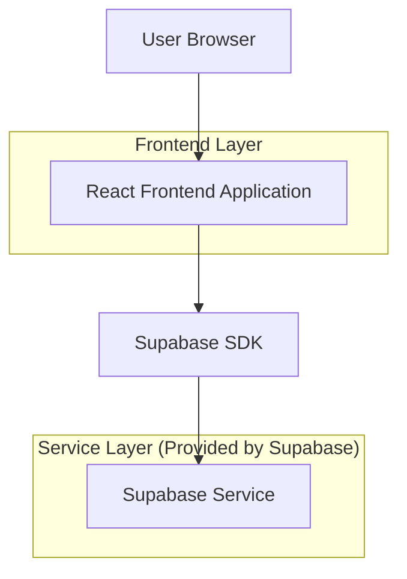
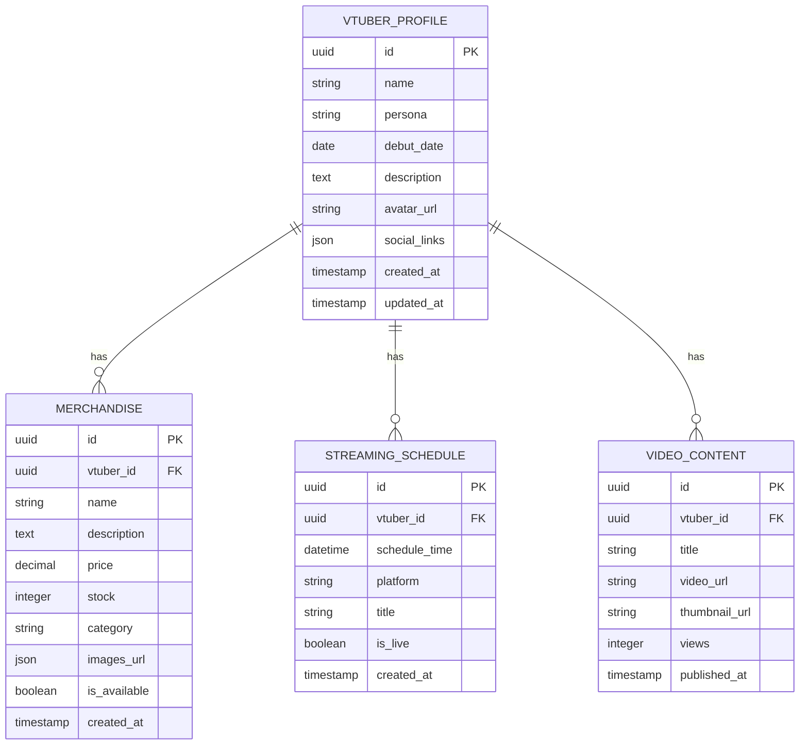

## 1. Architecture design



## 2. Technology Description
- Frontend: React@18 + tailwindcss@3 + vite
- Initialization Tool: vite-init
- Backend: Supabase
- Database: Supabase PostgreSQL
- Deployment: Netlify
- Routing: Netlify SPA configuration (netlify.toml and public/_redirects)

## 3. Route definitions
| Route | Purpose |
|-------|---------|
| / | Home page, menampilkan hero section dan video highlight |
| /profile | Profile page, biodata dan gallery VTuber |
| /merchandise | Merchandise page, katalog produk |
| /schedule | Schedule page, jadwal streaming dan event |
| /contact | Contact page, informasi kontak dan platform |
| /admin/login | Admin login untuk manajemen konten |
| /admin/dashboard | Admin dashboard untuk update data |

## 4. API definitions
Tidak ada backend custom yang diperlukan karena menggunakan Supabase secara langsung.

## 5. Server architecture diagram
Tidak ada server architecture karena menggunakan Supabase sebagai backend service.

## 6. Data model

### 6.1 Data model definition


### 6.2 Data Definition Language
VTUBER_PROFILE Table
```sql
-- create table
CREATE TABLE vtuber_profile (
    id UUID PRIMARY KEY DEFAULT gen_random_uuid(),
    name VARCHAR(100) NOT NULL,
    persona VARCHAR(100) NOT NULL,
    debut_date DATE,
    description TEXT,
    avatar_url VARCHAR(500),
    social_links JSONB,
    created_at TIMESTAMP WITH TIME ZONE DEFAULT NOW(),
    updated_at TIMESTAMP WITH TIME ZONE DEFAULT NOW()
);

-- create index
CREATE INDEX idx_vtuber_profile_name ON vtuber_profile(name);
```

MERCHANDISE Table
```sql
-- create table
CREATE TABLE merchandise (
    id UUID PRIMARY KEY DEFAULT gen_random_uuid(),
    vtuber_id UUID REFERENCES vtuber_profile(id),
    name VARCHAR(200) NOT NULL,
    description TEXT,
    price DECIMAL(10,2) NOT NULL,
    stock INTEGER DEFAULT 0,
    category VARCHAR(50),
    images_url JSONB,
    is_available BOOLEAN DEFAULT true,
    created_at TIMESTAMP WITH TIME ZONE DEFAULT NOW()
);

-- create index
CREATE INDEX idx_merchandise_vtuber_id ON merchandise(vtuber_id);
CREATE INDEX idx_merchandise_category ON merchandise(category);
```

STREAMING_SCHEDULE Table
```sql
-- create table
CREATE TABLE streaming_schedule (
    id UUID PRIMARY KEY DEFAULT gen_random_uuid(),
    vtuber_id UUID REFERENCES vtuber_profile(id),
    schedule_time TIMESTAMP WITH TIME ZONE NOT NULL,
    platform VARCHAR(50) NOT NULL,
    title VARCHAR(200) NOT NULL,
    is_live BOOLEAN DEFAULT false,
    created_at TIMESTAMP WITH TIME ZONE DEFAULT NOW()
);

-- create index
CREATE INDEX idx_streaming_schedule_vtuber_id ON streaming_schedule(vtuber_id);
CREATE INDEX idx_streaming_schedule_time ON streaming_schedule(schedule_time);
```

VIDEO_CONTENT Table
```sql
-- create table
CREATE TABLE video_content (
    id UUID PRIMARY KEY DEFAULT gen_random_uuid(),
    vtuber_id UUID REFERENCES vtuber_profile(id),
    title VARCHAR(200) NOT NULL,
    video_url VARCHAR(500),
    thumbnail_url VARCHAR(500),
    views INTEGER DEFAULT 0,
    published_at TIMESTAMP WITH TIME ZONE,
    created_at TIMESTAMP WITH TIME ZONE DEFAULT NOW()
);

-- create index
CREATE INDEX idx_video_content_vtuber_id ON video_content(vtuber_id);
```

-- Grant permissions
GRANT SELECT ON vtuber_profile TO anon;
GRANT SELECT ON merchandise TO anon;
GRANT SELECT ON streaming_schedule TO anon;
GRANT SELECT ON video_content TO anon;

GRANT ALL PRIVILEGES ON vtuber_profile TO authenticated;
GRANT ALL PRIVILEGES ON merchandise TO authenticated;
GRANT ALL PRIVILEGES ON streaming_schedule TO authenticated;
GRANT ALL PRIVILEGES ON video_content TO authenticated;